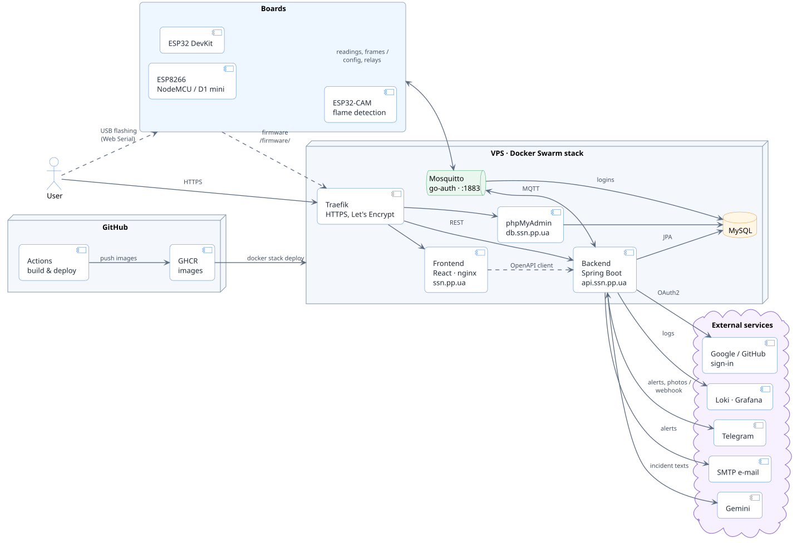

<div align="center">


# Smart Sensor Network

**IoT monitoring for home and lab sensors: ESP8266 / ESP32 boards, live dashboard, incidents, forecasts and alerts**

[](https://github.com/proteus1121/monitoring/actions/workflows/release.yml)
[](https://ssn.pp.ua)
[](LICENSE)


[Features](#-features) · [Architecture](#-architecture) · [Running locally](#-running-locally) · [Deployment](#-deployment) · [VPS setup](#-vps-setup)

</div>

---

Boards send readings over MQTT; a Spring Boot backend stores them, finds incidents, forecasts the next values and sends
alerts; a React site shows it all, configures the boards and updates their firmware. The interface is in Ukrainian
and English.

## ✨ Features

| | |
|---|---|
| 📟 **Boards and sensors** | NodeMCU v2, Wemos D1 mini, ESP32 DevKit, AI-Thinker ESP32-CAM. Modules: DHT11 / DHT22, MQ-2 (LPG, methane, smoke), BMP180, IR flame, light, PIR, soil moisture, any digital or analog input, relays, camera, OLED display |
| 🛠️ **Setup from the site** | Link a board by signing in from its access point page, scan its free pins for modules, configure sensors and the display over MQTT, calibrate the soil sensor, read the board's USB log. Each board gets its own broker login |
| ⬆️ **Firmware** | One firmware for every board, built by CI and published with the site. Boards update from the site over Wi-Fi; the Library page flashes a board from the browser over USB (Web Serial) |
| 📊 **Dashboard** | Live readings, history charts, a map of the boards, sharing whole boards with other users |
| 🚨 **Incidents and alerts** | Rule-based anomaly detection with multi-sensor patterns (e.g. a fire signature); alerts by Telegram and e-mail in each user's own time zone; incident explanations written by Gemini |
| 📈 **Forecasts** | Several models per device: ARIMA, Kalman filter, XGBoost and a small Transformer, with uncertainty bounds |
| 🔥 **Cameras** | The ESP32-CAM detects flame on the board; live view on the Cameras page, flame alerts carry the frame with the flame outlined |
| 🔐 **Sign-in** | Password, Google or GitHub |

## 🏗️ Architecture

<p align="center">
  
</p>

<sub>Source: [`docs/architecture.puml`](docs/architecture.puml). After editing it, re-render with
`java -jar plantuml.jar -tsvg docs/architecture.puml`.</sub>

| Part | Where | Stack |
|---|---|---|
| ☕ Backend | `src/main/java/org/proteus1121` | Java 17, Spring Boot 3.2, JPA, Spring Integration MQTT, XGBoost4J |
| ⚛️ Frontend | `src/frontend` | React 19, RTK Query generated from the OpenAPI spec, Ant Design, Tailwind, Chart.js |
| 🔌 Firmware | `scripts/251208-101749-esp32dev` | Arduino on PlatformIO: `esp8266`, `esp32dev`, `esp32cam` (+ `-ota` envs) |
| 📨 Broker | `mosquitto/` | mosquitto-go-auth, logins from the site database |
| 🌐 Proxy | `traefik/` | Traefik v2, HTTPS by Let's Encrypt |
| 🚀 Deploy | `.github/workflows/release.yml`, `docker-compose.yml` | GitHub Actions → GHCR → Docker Swarm |
| 📚 Docs | `docs/` | ML notes (`ml-architecture.md`), DB init script, teaching materials |

## 💻 Running locally

> **Requirements:** JDK 17, Node.js 20, Docker; Python with PlatformIO for the firmware.

```bash
# MySQL (+ phpMyAdmin on :8081) and Mosquitto on :1883
docker compose -f docker-compose.local.yml up -d

# backend on :8080, Swagger UI at /swagger-ui.html
./gradlew bootRun

# frontend against the local backend
cd src/frontend
npm ci --legacy-peer-deps
npm run dev:local
```

After a change to the backend API, regenerate the frontend client: `npm run api-typegen:local`.

<details>
<summary><b>Environment variables</b> (empty = the feature is off)</summary>

| Variable | For |
|---|---|
| `TELEGRAM_BOT_TOKEN` | Telegram alerts |
| `GOOGLE_CLIENT_ID`, `GOOGLE_CLIENT_SECRET` | Sign in with Google |
| `GITHUB_CLIENT_ID`, `GITHUB_CLIENT_SECRET` | Sign in with GitHub |
| `MAIL_HOST`, `MAIL_PORT`, `MAIL_USERNAME`, `MAIL_PASSWORD`, `MAIL_FROM` | E-mail alerts |
| `GEMINI_KEY` | Incident explanations and device descriptions |
| `GRAFANA_KEY` | Logs to Loki |

</details>

### 🔌 Firmware

```bash
cd scripts/251208-101749-esp32dev
cp secrets.example.ini secrets.ini   # OTA password and board addresses, not in git
pio run -e esp8266 -t upload         # over USB
pio run -e esp8266-ota -t upload     # over Wi-Fi
```

### 🧪 Tests

```bash
./gradlew test
# forecast model benchmark on CSV series, options in the ForecastBenchmark javadoc
./gradlew test --tests '*ForecastBenchmark' --rerun -Dforecast.benchmark=<dir of series csv> -Dforecast.benchmark.out=<csv>
```

## 🚀 Deployment

A push to `main` runs [`release.yml`](.github/workflows/release.yml):

1. builds the backend, the firmware (`esp8266`, `esp32dev`, `esp32cam`) and the frontend;
2. checks the broker logins;
3. pushes `ghcr.io/proteus1121/monitoring-backend` and `monitoring-frontend`;
4. deploys `docker-compose.yml` as the `monitoring_stack` stack.

<details>
<summary><b>Useful commands on the server</b></summary>

```bash
docker stack services monitoring_stack
docker service ps monitoring_stack_monitoring-backend
docker service ps monitoring_stack_mysql-db
docker logs $(docker ps -q --filter name=monitoring_stack_monitoring-backend)
docker logs $(docker ps -q --filter name=monitoring_stack_mysql-db)
docker pull ghcr.io/proteus1121/monitoring-backend:latest
docker stack rm monitoring_stack
```

</details>

<details>
<summary><b>Building the images by hand</b></summary>

```bash
./gradlew build
docker build . --no-cache -t ghcr.io/proteus1121/monitoring-backend:latest
docker build ./src/frontend --no-cache -t ghcr.io/proteus1121/monitoring-frontend:latest
docker run -e PROFILE=docker -t ghcr.io/proteus1121/monitoring-backend:latest
```

</details>

## 🖥️ VPS setup

<details>
<summary><b>New VPS for the stack:</b> Docker, Docker Swarm, swap and Docker data on an extra disk</summary>

### 1. Install Docker

From the [official guide](https://docs.docker.com/engine/install/ubuntu/):

```bash
sudo apt-get update
sudo apt-get install -y ca-certificates curl
sudo install -m 0755 -d /etc/apt/keyrings
sudo curl -fsSL https://download.docker.com/linux/ubuntu/gpg -o /etc/apt/keyrings/docker.asc
sudo chmod a+r /etc/apt/keyrings/docker.asc

echo "deb [arch=$(dpkg --print-architecture) signed-by=/etc/apt/keyrings/docker.asc] https://download.docker.com/linux/ubuntu $(. /etc/os-release && echo "${UBUNTU_CODENAME:-$VERSION_CODENAME}") stable" | sudo tee /etc/apt/sources.list.d/docker.list > /dev/null
sudo apt-get update

sudo apt-get install -y docker-ce docker-ce-cli containerd.io docker-buildx-plugin docker-compose-plugin
```

### 2. Initialize Docker Swarm

```bash
sudo docker swarm init --advertise-addr 139.59.148.159
```

### 3. Create swap

With little RAM, swap prevents out-of-memory errors. 1G is used here; 512M should also be fine.

```bash
sudo fallocate -l 1G /swapfile
sudo chmod 600 /swapfile
sudo mkswap /swapfile
sudo swapon /swapfile
echo '/swapfile none swap sw 0 0' | sudo tee -a /etc/fstab
```

### 4. Move Docker data to an extra disk

If the root partition is small, move Docker's storage to an attached volume:

```bash
sudo systemctl stop docker
sudo mv /var/lib/docker /mnt/volume_fra1_02/docker
sudo ln -s /mnt/volume_fra1_02/docker /var/lib/docker
sudo systemctl start docker
docker info | grep "Docker Root Dir"
```

> [!NOTE]
> Make sure the volume is mounted at boot (`/etc/fstab`).

</details>

## 📄 License

[MIT](LICENSE)
